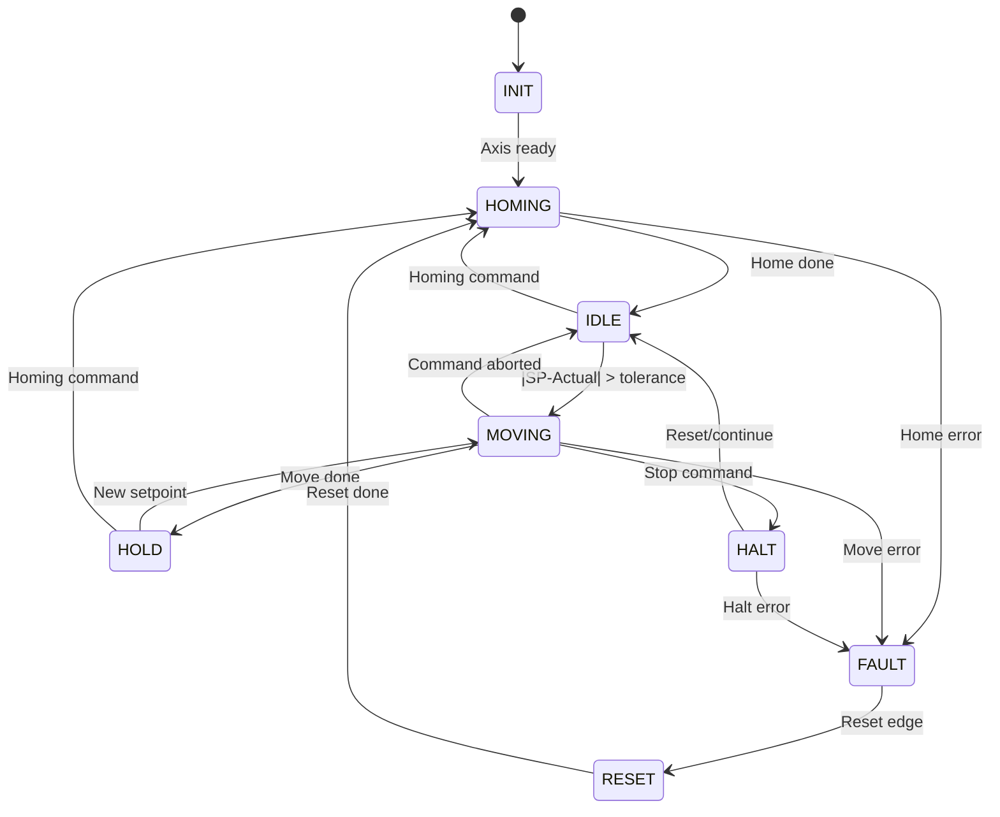
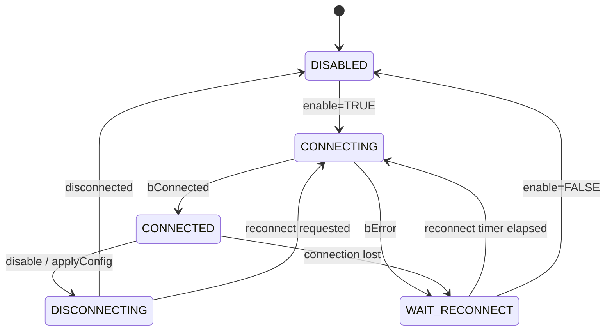
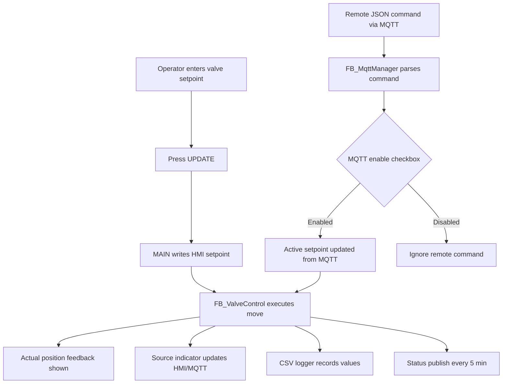

# System Design & Rebuild Guide

## 1) PLC Program Modules

### `MAIN`
- Integrates HMI, MQTT, valve FBs, logger FB.
- Performs setpoint arbitration and source tagging.
- Copies runtime data to HMI-facing global variables.

### `FB_ValveControl`
- Per-valve motion state machine.
- Uses PLCopen FBs from `TC2_MC2`:
  - `MC_Power`, `MC_Home`, `MC_MoveAbsolute`, `MC_Halt`, `MC_Reset`, `MC_ReadActualPosition`.
- Converts % command to stroke in mm.

### `FB_MqttManager`
- Connect/disconnect/reconnect logic.
- Subscribe/publish support.
- Parses incoming JSON into `ST_MQTT_Command`.
- Builds outgoing JSON status payload.

### `FB_CsvLogger`
- Periodic/forced logging to local CSV.
- Includes valve setpoint/actual/source + sensor values.
- Non-blocking file FB workflow.

---

## 2) Valve State Machine Diagram

---

## 3) MQTT Manager State Diagram

---

## 4) HMI Functional Flow Diagram

---

## 5) Recreate Project Step-by-Step

1. Install TwinCAT 3 XAE and required licenses/modules.
2. Ensure libraries are available:
   - `Tc2_MC2`
   - `Tc3_IotBase` (TF6701)
   - `Tc3_JsonXml`, `Tc2_Utilities`, `Tc2_System`
3. Open `VeKsi_Project.sln`.
4. Verify PLC task cycle and NC axis binding.
5. Map digital/analog process image to `GVL_IO`.
6. Configure homing and soft limits in NC axis configs.
7. Configure MQTT defaults in `GVL_Config` and `ST_MqttConfig`.
8. Build and activate configuration.
9. Download boot project.
10. Validate via commissioning checklist in README.

---

## 6) Industrial Practice Notes Applied

- Deterministic state-machine-based motion.
- Source-tracked command arbitration (HMI vs MQTT).
- Bounded setpoint limits (0..100%).
- Non-blocking IO operation for file logging.
- Fault/ready status made explicit for HMI diagnostics.
- Modular FB separation to support repurposing.

